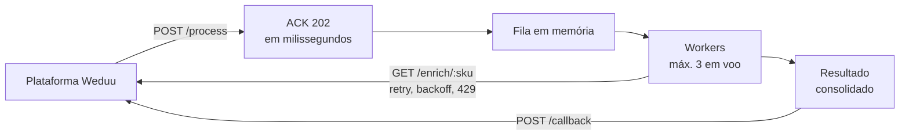

<h1 align="center">Weduu Webhook Service</h1>

<p align="center">
  Serviço webhook que recebe lotes de SKUs, confirma o recebimento em milissegundos,<br>
  processa em segundo plano e devolve o resultado consolidado à plataforma.
</p>

<p align="center">
  
</p>

<p align="center">
  
  
  
  
  
  
  
</p>

---

## Como funciona



| Princípio | Como foi resolvido |
|---|---|
| **ACK rápido** | `/process` valida, deduplica e responde `202` antes de qualquer trabalho |
| **Concorrência** | semáforo global de 3 chamadas em voo ao `/enrich` |
| **Idempotência** | dedupe por `run_id` + `seq` e cache por SKU |
| **Falhas** | retry com backoff e jitter, `retry-after` no 429, 401 e 404 sem retry |
| **Callback** | enviado uma única vez, com os itens ordenados por `seq` |

Decisões de arquitetura, trade-offs e o cenário de 20.000 SKUs: [docs/DECISOES.md](docs/DECISOES.md).

## Como executar

Requisitos: Node.js >= 24. Não há `npm install`. O ngrok só é necessário para a plataforma real.

```bash
npm test            # 21 testes com uma plataforma simulada (~95 s)
npm run demo        # fluxo completo local: registra, pede um lote e imprime o relatório
npm run demo:real   # fluxo completo contra a plataforma Weduu (abre o ngrok sozinho)
```

O `demo` aceita `TOTAL`, `DUP_RATE` e `ERROR_RATE` para variar o cenário. O `demo:real` exige o ngrok instalado e autenticado, e a porta 4000 livre.

## Relatório da melhor execução

**[reports/melhor-execucao-real.md](reports/melhor-execucao-real.md)**: execução na plataforma real.

| Critério | Resultado |
|---|---|
| Score | **100/100** |
| Itens corretos | 20 de 20 |
| ACK mediano / pior | 382 ms / 434 ms (alvo: 600 ms) |
| Duplicata | tratada, 1 chamada ao enrich |
| Erros 500 forçados | 3, todos recuperados |
| Respostas 429 | 0 |

Em vários lotes reais o score ficou entre 97 e 100. O ACK medido inclui o túnel ngrok, e a variação vem da rede, não do processamento. O relatório contra o mock local está em [reports/melhor-execucao.md](reports/melhor-execucao.md).

## Execução manual contra a plataforma real

```bash
npm start                                                   # terminal 1: serviço (porta 4000)
ngrok http 4000                                             # terminal 2: túnel público
WEBHOOK_URL=https://<id>.ngrok-free.app npm run register    # terminal 3: registra (a plataforma chama /check)
```

O registro grava `.credentials.json`. Reinicie o `npm start` para carregá-lo e dispare o lote com `npm run burst`. Acompanhe em `GET http://localhost:4000/runs/<run_id>`.

<details>
<summary>Variáveis de ambiente opcionais</summary>

`PORT` (4000), `PLATFORM_URL`, `WEBHOOK_URL`, `WEBHOOK_NAME`, `ENRICH_CONCURRENCY` (3), `ENRICH_MAX_RETRIES` (6), `CALLBACK_MAX_RETRIES` (5), `BACKOFF_BASE_MS` (200), `CREDENTIALS_FILE`.

</details>

## Testar as rotas à mão (opcional)

- **Swagger UI:** com `npm start` rodando, abra http://localhost:4000/docs. Com o ngrok aberto, o fluxo real roda só por lá: `POST /register` (URL do ngrok), `POST /burst` e `GET /runs/{id}` (o relatório fica em `callback.report`).
- **Postman:** importe [docs/postman-collection.json](docs/postman-collection.json). A pasta "A. Fluxo automático" (com `npm start` e `ngrok http 4000` abertos) pega a URL do ngrok, registra, pede o lote, descobre um SKU real e testa `/enrich` e `/callback`. A pasta "B" testa as rotas do serviço (ACK, duplicata e validação). As rotas da plataforma só aparecem no Postman, porque o navegador bloqueia chamadas a elas (CORS).

## Estrutura

```
src/
  index.js            entrada (carrega credenciais, sobe o servidor)
  app.js              rotas HTTP e orquestração
  openapi.json        especificação servida em /openapi.json (Swagger UI)
  queue.js            fila FIFO em memória com N workers
  run-store.js        estado por run: itens, dedupe, cache por SKU, contadores
  enrich-client.js    /enrich com semáforo global, retry/backoff e tratamento de 429
  platform-client.js  register, burst e callback (com retry)
  config.js, util.js, logger.js
scripts/              register.js, burst.js, demo.js
test/                 e2e, unitários, mock da plataforma, report.js
reports/              relatórios das execuções (real e mock)
docs/                 DECISOES.md e coleção do Postman
```
